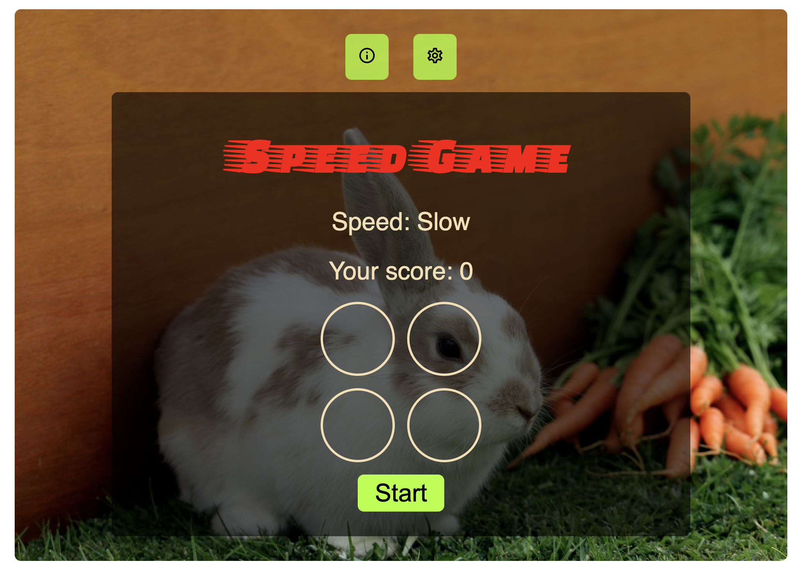

# Speed Game

## Description

When you start the game, it will give option, if you click the correct option, game will continue and gives new option. From the setting icone, game speed can be changed.

## Technologies used

Build with:

- HTML
- CSS
- JS

## Setup and usage

### Live page

[Speed game](https://public.bc.fi/s2300096/speed__game/)

### How the game end

If you click wrong option, game will end.
If you miss correct option 3 times
IF you click stop button

### Resetting game

When the game is ended, a modal will appear. If you close the modal, game will reset.

## Screenshot

